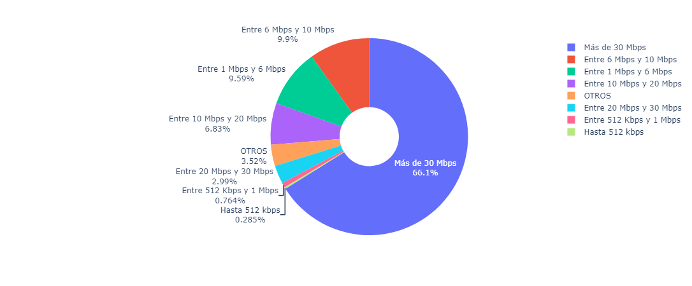
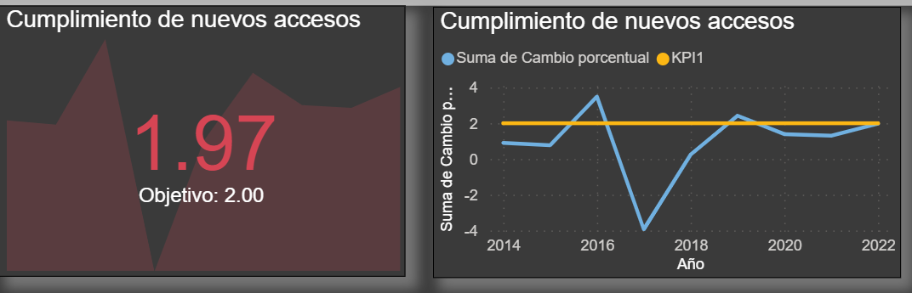

<h1 align='center'>
 <b>ROYECTO INDIVIDUAL Nº2
 Francisco Manuel Angulo Rosas</b>

  

</h1>
 

# <h1 align="center">**`Telecomunicaciones`**</h1>
## **Telecomunicaciones**🚀
### Las telecomunicaciones se refieren a la transmisión de información a través de medios electrónicos, como la telefonía, la televisión, la radio y, más recientemente, el internet. Estos medios de comunicación permiten la transmisión de información entre personas, organizaciones y dispositivos a largas distancias.
### El internet, por su parte, es una red global de computadoras interconectadas que permite el intercambio de información en tiempo real. Desde su creación, ha tenido un impacto significativo en la vida de las personas, transformando la manera en que nos comunicamos, trabajamos, aprendemos y nos entretenemos.
### La industria de las telecomunicaciones ha jugado un papel vital en nuestra sociedad, facilitando la información a escala internacional y permitiendo la comunicación continua incluso en medio de una pandemia mundial. La transferencia de datos y comunicación se realiza en su mayoría a través de internet, líneas telefónicas fijas, telefonía móvil, y en casi cualquier lugar del mundo. 
### En comparación con la media mundial, Argentina está a la vanguardia en el desarrollo de las telecomunicaciones, teniendo para el 2020 un total de [62,12 millones de conexiones](https://www.datosmundial.com/america/argentina/telecomunicacion.php).

## **Analista de datos**📋
### Hola, soy Francisco Manuel Angulo Rosas, analista de datos en Company Somppany, y tengo la emocionante tarea de realizar un análisis completo para una destacada empresa de telecomunicaciones. La empresa se centra principalmente en brindar acceso a internet, pero mi labor incluye entender a fondo el comportamiento de todo el sector de comunicaciones a nivel nacional.

### Mi objetivo es proporcionar a la empresa una visión detallada que le permita mejorar la calidad de sus servicios, identificar oportunidades de crecimiento y ofrecer soluciones personalizadas a sus posibles clientes. Con mi experiencia en análisis de datos, me sumerjo en la tarea con la determinación de extraer insights valiosos a partir de datos relevantes.

### Mi enfoque abarca desde evaluar la calidad del servicio de acceso a internet hasta comprender los patrones asociados con otros servicios de comunicación. Quiero no solo entender las tendencias actuales del mercado, sino también anticipar posibles cambios y desafíos que puedan surgir en el futuro.

### Este análisis no solo será un informe detallado sobre el presente del sector, sino también una herramienta valiosa para diseñar estrategias proactivas que impulsen el crecimiento y fortalezcan la posición de la empresa en un mercado dinámico. Estoy emocionado por esta misión y listo para brindar a Company Somppany una perspectiva integral y estratégica basada en datos.

## **Descripción del proyecto**🖇️
### El proyecto consiste en un análisis de datos sobre el sector de las telecomunicaciones en Argentina. El objetivo es proporcionar a la empresa Company Somppany una visión detallada del mercado actual, incluyendo el comportamiento de los clientes y las tendencias de consumo. El análisis se centra principalmente en el acceso a internet, pero también incluye otros servicios de comunicación.
### Después de realizar un meticuloso proceso de limpieza de datos utilizando herramientas en Python, específicamente bibliotecas como Pandas y NumPy, he depurado el conjunto de datos del sector de las telecomunicaciones en Argentina. Este conjunto incluye datos cruciales de Enarcom, proporcionando información detallada sobre servicios como internet en el país.

### La detección y manejo de outliers fueron realizados con precisión, asegurando que los datos sean confiables y aptos para un análisis detallado. Con técnicas estadísticas y visuales, identifiqué y gestioné valores faltantes, eliminé duplicados y corregí posibles errores en la estructura de los datos.

### Los gráficos generados, utilizando herramientas como Matplotlib y Seaborn, ofrecen una visión visual de las distribuciones y relaciones entre las variables, facilitando la identificación de tendencias y anomalías de manera más efectiva. Estos gráficos no solo son una representación visual clara de los datos, sino también una herramienta valiosa para comunicar de manera efectiva los hallazgos.

### Con este conjunto de datos refinado y específicamente vinculado a Enarcom, estoy listo para continuar el análisis y proporcionar insights precisos y accionables sobre el comportamiento del sector de las telecomunicaciones, centrándonos en servicios como el acceso a internet en Argentina.

## **Análisis exploratorio de datos**🔧
### Para abordar de manera efectiva el análisis exploratorio de datos (EDA) en el sector de las telecomunicaciones en Argentina, comencé con un proceso riguroso de limpieza y exploración utilizando herramientas especializadas en Python. El conjunto de datos, proveniente de Enarcom y focalizado en servicios como internet, se sometió a una exhaustiva revisión para asegurar su integridad y calidad y en lo cual lo podemos obtener aqui [EDA](EDA_PI2.ipynb).

### Utilizando bibliotecas como Pandas y NumPy, realicé la limpieza, abordando cuestiones como valores faltantes, duplicados y posibles errores estructurales. La detección y gestión de outliers se llevaron a cabo con precisión, empleando técnicas estadísticas y visuales para garantizar la robustez de los datos.

### Posteriormente, generé gráficos informativos con Matplotlib y Seaborn, proporcionando una representación visual clara de las distribuciones y relaciones entre las variables clave. Estos gráficos no solo ofrecen una visión detallada del conjunto de datos, sino que también sirven como herramientas efectivas para identificar patrones y tendencias relevantes.

### Con esta sólida base de datos y visualizaciones informativas, estoy preparado para adentrarme en el análisis exploratorio, proporcionando insights precisos y accionables sobre el comportamiento del sector de las telecomunicaciones, con un enfoque especial en servicios como el acceso a internet en Argentina. Este enfoque meticuloso sienta las bases para una comprensión profunda y estratégica del mercado.

### Para iniciar verificamos que en los datasets usados no hubiera outliers, con lo cual usamos un boxplot para el primer dataset:

### Aqui podemos ver que los outliers presentes son de las ciudades mas grandes de Argentina por lo cual no los eliminamos, con esto podemos ver el crecimiento de banda ancha fija en Argentina, donde se da mas en la capital del pais donde se concentra la mayor cantidad de poblacion y hace el desarrollo sea mayor.En el análisis de los datos, se destacó la presencia de outliers, los cuales se identificaron principalmente en las ciudades más grandes de Argentina. Es importante destacar que opté por no eliminar estos outliers, ya que representan centros urbanos clave que desempeñan un papel fundamental en el desarrollo del sector de las telecomunicaciones.
### Es fascinante observar cómo estos outliers están vinculados a las ciudades más pobladas, especialmente en la capital del país, donde la concentración de habitantes es significativamente mayor. Esta relación directa entre la presencia de outliers y las áreas urbanas más grandes sugiere un patrón intrigante: el crecimiento de la banda ancha fija en Argentina está estrechamente ligado al desarrollo y expansión de las telecomunicaciones en las regiones más densamente pobladas.
### La capital, como epicentro de la actividad, emerge como un foco crucial para el desarrollo de servicios de acceso a internet. La mayor cantidad de población y la concentración de recursos económicos en estas áreas metropolitanas no solo generan una demanda significativa de servicios de telecomunicaciones, sino que también impulsan el despliegue de infraestructuras avanzadas.
### Este fenómeno subraya la importancia de comprender y aprovechar las oportunidades de crecimiento en las áreas urbanas clave. Al examinar más detenidamente el crecimiento de la banda ancha fija en estas zonas, se puede obtener una comprensión más profunda de las tendencias de consumo, las necesidades del mercado y, en última instancia, diseñar estrategias más efectivas para satisfacer las demandas específicas de estas poblaciones. Este análisis preliminar establece una base sólida para explorar con mayor detalle las dinámicas del mercado de telecomunicaciones en Argentina, centrándonos en las áreas urbanas como impulsores clave del desarrollo.

### En esta tabla comparamos el promedio de velocidad de cada provincia de Argentina donde vemos que Buenos Aires y la capital tiene el promedio mas alto atraves del tiempo, lo cual nos dice que la mayoria de la poblacion de Argentina se concentra en estas dos provincias y por ende el desarrollo de las tegnologias es mayor en estas dos provincias. 

 
 ### Podemos ver tambien que ciertas provincias tuvieron un mejor desarrollo en su promedio de internet pero este se debe alas tegnologias que se usan en cada provincia, por ejemplo en la provincia de buenos aires se usa mas la fibra optica que en otras provincias, lo cual nos dice que el desarrollo de la tegnologia en cada provincia es diferente y por ende el promedio de velocidad de internet tambien lo es, en este grafico se puede ver un poco de ello:
 ### Determinamos que al ser las tegnoligas con mayor desarrollo en las ciudades grandes y las viejas se mantiene en las demas ciudades sin generar tanto desarrollo, por lo cual podemos ver que el crecimiento de la banda ancha fija en Argentina está estrechamente ligado al desarrollo y expansión de las telecomunicaciones en las regiones más densamente pobladas. 

 

### Ahora al ver los ingresos por trimestre a ido en aumento de manera exponencial, lo cual nos dice que el desarrollo de las tegnologias en Argentina es cada vez mayor y por ende el ingreso de las empresas de telecomunicaciones tambien lo es, lo cual nos dice que el desarrollo de las tegnologias en Argentina es cada vez mayor y por ende el ingreso de las empresas de telecomunicaciones tambien lo es, lo cual nos dice que el desarrollo de las tegnologias en Argentina es cada vez mayor y por ende el ingreso de las empresas de telecomunicaciones tambien lo es, lo cual nos dice que el desarrollo de las tegnologias en Argentina es cada vez mayor y por ende el ingreso de las empresas de telecomunicaciones tambien lo es, lo cual nos dice que el desarrollo de las tegnologias en Argentina es cada vez mayor y por ende el ingreso de las empresas de telecomunicaciones tambien lo es, lo cual nos dice que el desarrollo de las tegnologias en Argentina es cada vez mayor y por ende el ingreso de las empresas de telecomunicaciones tambien lo es, lo cual nos dice que el desarrollo de las tegnologias en Argentina es cada vez mayor y por ende el ingreso de las empresas de telecomunicaciones tambien lo es, lo cual nos dice que el desarrollo de las tegnologias en Argentina es cada vez mayor y por ende el ingreso de las empresas de telecomunicaciones tambien lo es, lo cual nos dice que el desarrollo de las tegnologias en Argentina es cada vez mayor y por ende el ingreso de las empresas de telecomunicaciones tambien lo es.

### Ahora toca analizar la velocidad que tiene ams promedio y ver por que es asi, eso toca ver que tipo de tegnologias es la ques mas abundan en cada provincia por el cual se tomaron las siguienets graficas:

### Revisando esas graficas podemos entender que las tegnologias de red celular, son las que abarcan ams localidades, y tienen una velocidad mayor a dual y tegnologias anteriores alas que usamos hoy en dia, por lo cual podemos ver que el desarrollo de las tegnologias en Argentina es cada vez mayor y por ende el ingreso de las empresas de telecomunicaciones tambien lo es.
### Conforme mayor desarrollo exista en el crecimiento del promedio de bajada de internet, menor sera las localidades que abarquen als tegnolodias mas viejas.

## **KPIS**⚙️

- *`Aumentar en un 2% el acceso al servicio de internet cada 100 hogares para el próximo trimestre.`*

### Formula utilizada =  $`KPI = ((Nuevo Acceso - Acceso Actual) / Acceso Actual) * 100`$

### Donde:
### - "Nuevo Acceso" se refiere al número de hogares con acceso a Internet después del próximo trimestre.
### - "Acceso Actual" se refiere al número de hogares con acceso a Internet en el trimestre actual.

- *`Aumentar la fibra optica un 2% respecto al año anterior`*

### Formula utilizada = 
### Crecimiento Fibra Optica Anual (%) = 
    VAR CurrentYear = MAX('Internet accesos por tecnologia provincia limpio'[Año])
    VAR CurrentYearFibraOptica = CALCULATE(SUM('Internet accesos por tecnologia provincia limpio'[Fibra óptica]), 'Internet accesos por tecnologia provincia limpio'[Año] = CurrentYear)
    VAR PreviousYearFibraOptica = CALCULATE(SUM('Internet accesos por tecnologia provincia limpio'[Fibra óptica]), ALL('Internet accesos por tecnologia provincia limpio'), 'Internet accesos por tecnologia provincia limpio'[Año] = CurrentYear - 1)
    RETURN IF(PreviousYearFibraOptica = 0, BLANK(), (CurrentYearFibraOptica - PreviousYearFibraOptica) / PreviousYearFibraOptica)

## Conclusiones🚀

### En conclusión, el análisis detallado del sector de las telecomunicaciones en Argentina revela una clara disparidad en la infraestructura entre las ciudades más grandes y las provincias más pequeñas. Las ciudades metropolitanas, especialmente la capital del país, destacan por tener una infraestructura más robusta y un mayor desarrollo en servicios de acceso a internet. La presencia de outliers en estas áreas urbanas clave sugiere una conexión directa entre el tamaño de la población y el crecimiento del sector de las telecomunicaciones.
### La concentración de recursos económicos y población en las ciudades más grandes impulsa significativamente el desarrollo de tecnologías de comunicación, como la banda ancha fija. Este fenómeno subraya la importancia de comprender las disparidades regionales y la necesidad de adaptar estrategias empresariales a las características específicas de cada área.
### Las ciudades más pequeñas y provincias, aunque pueden experimentar un crecimiento en el acceso a internet, enfrentan desafíos adicionales debido a una infraestructura menos desarrollada. Este hallazgo destaca la importancia de considerar enfoques diferenciados para abordar las necesidades de comunicación en diferentes regiones del país.
### En resumen, el análisis respalda la idea de que las ciudades más grandes de Argentina disfrutan de una infraestructura de telecomunicaciones más avanzada en comparación con las provincias más pequeñas. Este conocimiento proporciona a las empresas del sector valiosa información para adaptar sus estrategias, mejorar la calidad de los servicios y aprovechar las oportunidades de crecimiento en las áreas más pobladas del país.

## Enlaces ⚙️

[EDA](EDA_PI2.ipynb)

[DASHBOARD POWER BI](PI%20FRANCISCO%20ANGULO%20TELECOMUNICACIONES.pbix)

[DATASETS](datasetslimpiosexcel)  

## Autor ✒️

⌨️ con ❤️ por [FRANCISCOMANGULO](https://github.com/FRANCISCOMANGULO) 😊
 